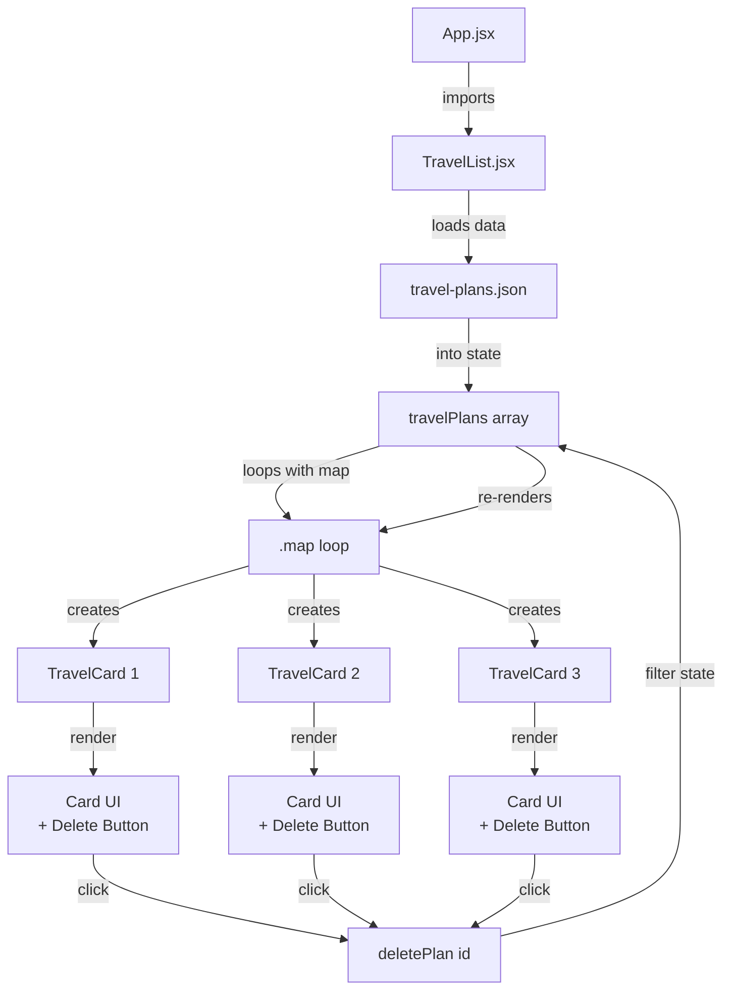

# Project Notes

## Setup

``` bash
npm install
npm run dev
```

### `npm install`

-   Reads **package.json**
-   Downloads all required libraries (React, Vite, etc.)
-   Stores them in a folder called **node_modules**

------------------------------------------------------------------------

### `npm run dev` --- **Run this every session**

**What it does:** - Starts the development server\
- Compiles your React code\
- Watches for file changes (**hot reload**)\
- Serves the app in the browser:

    VITE v4.4.9  ready in 676 ms

    ➜  Local:   http://localhost:5173/
    ➜  Network: use --host to expose
    ➜  press h to show help

------------------------------------------------------------------------

## Using State

``` javascript
import { useState } from "react";
import travelPlansData from "../assets/travel-plans.json";
```

------------------------------------------------------------------------

### 1️⃣ `useState(travelPlansData)`

This says:

> "Create a piece of React state, and start it with the value from
> `travelPlansData`."

**At the beginning:**

-   `travelPlansData` = array from JSON\
-   State starts as that same array

**Think:**

``` javascript
State = [
  { id: 1, destination: "Paris", ... },
  { id: 2, destination: "Rome", ... },
]
```

------------------------------------------------------------------------

### 2️⃣ Destructuring: `[travelPlans, setTravelPlans]`

`useState()` returns an array with **2 things**:

``` javascript
[
  currentValue,
  functionToUpdateValue
]
```

We unpack it like this:

-   **travelPlans** → current state value from the JSON import\
-   **setTravelPlans** → function to update that state (future state)

⚠️ You never modify `travelPlans` directly.

------------------------------------------------------------------------

### 3️⃣ Why two variables?

``` javascript
travelPlans.map(...)
```

✅ **Reading state**

Later:

``` javascript
setTravelPlans(newArray);
```

✅ **Updating state → React re-renders**

------------------------------------------------------------------------

### Example Component

``` javascript
function TravelList() {
  const [travelPlans, setTravelPlans] = useState(travelPlansData);

  return (
    <div>
      {travelPlans.map((plan) => (
        <TravelCard key={plan.id} plan={plan} />
      ))}
    </div>
  );
}
```

**Meaning:**

> "For each trip, show a `TravelCard` component, give it a unique ID so
> React can track it, and hand the whole trip's data to that card so it
> can display it."

------------------------------------------------------------------------

## Styling

### `index.css` --- Global CSS (entire app)

**What it is:** - Loaded once when the app starts\
- Affects everything\
- Applies to all components automatically

------------------------------------------------------------------------

### `App.css` --- App-level / layout styling

**What it is:** - Styling specific to the `App` component\
- Imported explicitly in `App.jsx`

``` javascript
import "./App.css";
```

**Typical use:** - Header layout\
- Logo size\
- App-wide sections\
- Things that appear once

👉 **We'll style elements in `index.css`.**

------------------------------------------------------------------------

## Label Rendering

``` jsx
<div className="labels">
  {costLabel && <span className="label">{costLabel}</span>}
  {plan.allInclusive && (
    <span className="label all-inclusive">All Inclusive</span>
  )}
</div>
```

### What this means:

``` jsx
{costLabel && <span className="label">{costLabel}</span>}
```

> "If `costLabel` exists (is truthy), render the `<span>`.\
> If it doesn't exist, render nothing."

✅ **Rule:** *Render JSX only if the condition is true.*

------------------------------------------------------------------------

## Delete Plans

``` javascript
const deletePlan = (id) => {
  setTravelPlans(travelPlans.filter((plan) => plan.id !== id));
};
```

**Meaning:**

> Keep all the trips **except** the one with this ID, then update the
> list.

**For each plan:** - If `plan.id !== id` → ✅ KEEP it\
- If `plan.id === id` → ❌ REMOVE it

------------------------------------------------------------------------

### How `.filter()` works

``` javascript
array.filter(condition)
```

-   Goes through each item in the array\
-   Keeps the item if the condition is **true**\
-   Removes the item if the condition is **false**\
-   Returns a **new array** (does NOT change the original)

------------------------------------------------------------------------

## Is it Props or State?

### How do I know?

✅ **If a value comes into a component → it's a prop.**\
✅ **If a value is created inside a component with `useState` → it's a state.**

---

## Rendering Process Diagram



**Simple Flow:**
1. App → TravelList
2. TravelList loads JSON data into state
3. Loop creates a TravelCard for each trip
4. Each card shows trip info + delete button
5. Delete clicked → removes from state → re-renders all